# 📘 Experiment 1: Designing and Implementing a Sample Database System using DDL, DML, and DCL


## 🧑‍🎓 Student Information

* **Name:** Prateek Verma
* **UID:** 25MCC20062
* **Branch:** MCA (CC & DevOps)
* **Semester:** II
* **Section/Group:** 25MCC-101/A
* **Subject:** Technical Training
* **Subject Code:** 25CAP-652
* **Date of Performance:** 07/01/2026

## 🎯 Aim

To design and implement a sample database system using:

* **DDL (Data Definition Language)**
* **DML (Data Manipulation Language)**
* **DCL (Data Control Language)**

This includes database creation, data manipulation, schema modification, and role‑based access control to ensure data integrity and secure access.


## 🧰 Software Requirements

* **Database Server:** PostgreSQL
* **Database Tool:** pgAdmin
* **Operating System:** Windows


## 🎯 Objectives

* Gain practical experience with DDL, DML, and DCL commands
* Create and manage relational database schemas
* Enforce integrity and domain constraints
* Implement role‑based privileges for secure database access
* Understand schema modification and dependency handling


## ⚙️ Procedure

1. Start the system.
2. Open **pgAdmin**.
3. Create and select the required database.
4. Establish a connection using **Alt + Shift + Q**.
5. Execute the SQL queries listed in the experiment steps.


## 🧪 Experiment Steps

### 1️⃣ Table Creation (DDL)

#### 🔹 Department Table

```sql
CREATE TABLE department (
  dept_id INT PRIMARY KEY,
  dept_name VARCHAR(20) NOT NULL UNIQUE
);
```

#### 🔹 Project Table

```sql
CREATE TABLE project (
  proj_id INT PRIMARY KEY,
  proj_name VARCHAR(50) NOT NULL,
  dept_id INT NOT NULL,
  FOREIGN KEY (dept_id) REFERENCES department(dept_id)
);
```

#### 🔹 Employee Table

```sql
CREATE TABLE employee (
  emp_id VARCHAR(10) PRIMARY KEY,
  emp_name VARCHAR(30) NOT NULL,
  dept_id INT NOT NULL,
  proj_id INT NOT NULL,
  FOREIGN KEY (dept_id) REFERENCES department(dept_id)
    ON DELETE CASCADE ON UPDATE CASCADE,
  FOREIGN KEY (proj_id) REFERENCES project(proj_id)
    ON DELETE CASCADE ON UPDATE CASCADE
);
```


### 2️⃣ Insert Sample Data (DML)

#### 🔹 Insert into Department

```sql
INSERT INTO department VALUES
(1, 'Sales'),
(2, 'Marketing'),
(3, 'Legal'),
(4, 'IT'),
(5, 'Accounts'),
(6, 'HR');
```
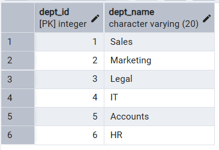

#### 🔹 Insert into Project

```sql
INSERT INTO project VALUES
(1000, 'Lead Gen Campaign', 1);
```
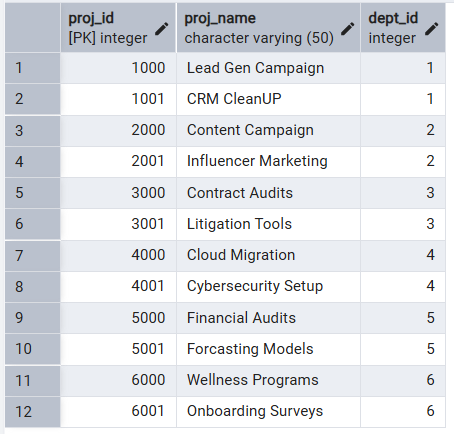
#### 🔹 Insert into Employee

```sql
INSERT INTO employee VALUES
('E100', 'Vikram Singh', 1, 1000);
```
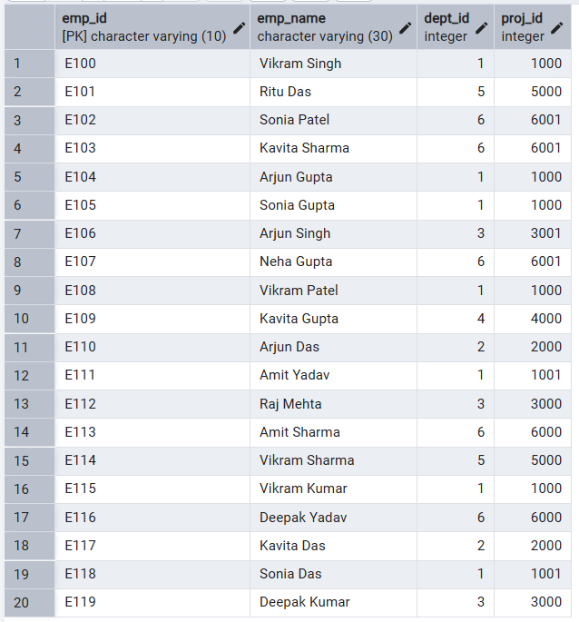


### 3️⃣ DML Operations (UPDATE & DELETE)

#### 🔹 Update Query

```sql
UPDATE employee
SET proj_id = 6000
WHERE proj_id = 6001;
```
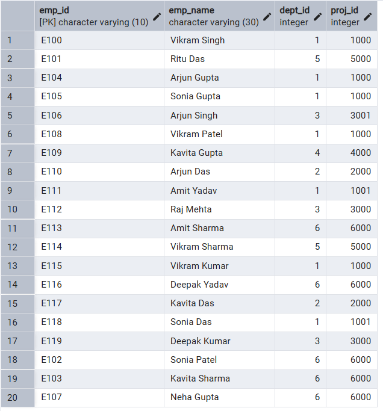

#### 🔹 Delete Query

```sql
DELETE FROM project
WHERE dept_id = 3;
```
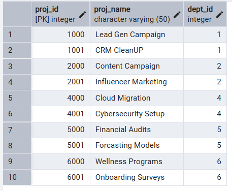

### 4️⃣ Access Control & Security (DCL)

#### 🔹 Create User

```sql
CREATE USER reporter WITH PASSWORD 'reporter@123';
```
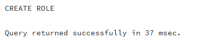

#### 🔹 Grant SELECT Privileges

```sql
GRANT SELECT ON employee, department, project TO reporter;
```
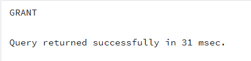

#### 🔹 Revoke CREATE Privilege on Schema

```sql
REVOKE CREATE ON SCHEMA public FROM reporter;
```
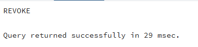


### 5️⃣ Schema Modification

#### 🔹 Add New Column

```sql
ALTER TABLE employee ADD COLUMN base_sal INT;
```
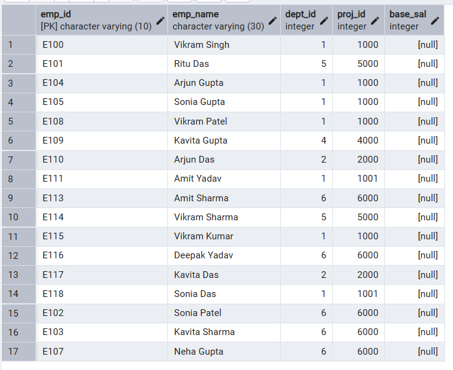

#### 🔹 Drop Foreign Key Constraint

```sql
ALTER TABLE employee
DROP CONSTRAINT employee_proj_id_fkey;
```
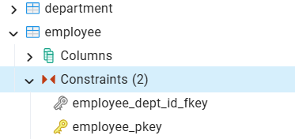

#### 🔹 Drop Project Table

```sql
DROP TABLE project;
```
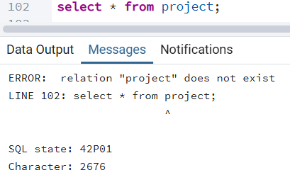


### 6️⃣ Role Verification & Testing

* Create a new connection using the **reporter** role

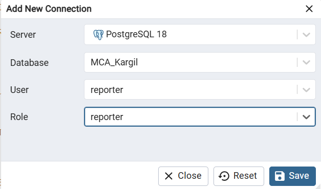<br>

* Verify SELECT privilege on `employee` table

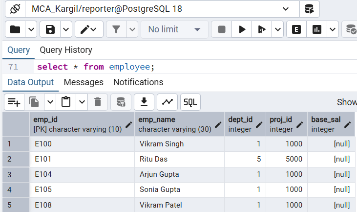<br>

* Confirm lack of CREATE privilege on the experiment schema

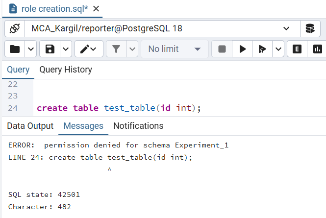<br>


## 📥 Input / Output Details

* **Input:** SQL queries executed as per the experiment steps.
* **Output:** Result sets and execution status displayed in pgAdmin after each query.


## 🎓 Learning Outcomes

* Learned practical usage of **DDL, DML, and DCL** commands in SQL
* Understood how to enforce integrity and domain constraints
* Gained experience in **DBMS privilege and role management**
* Learned schema modification while handling dependencies


