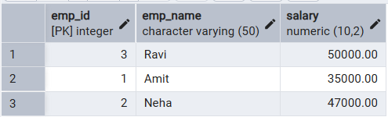
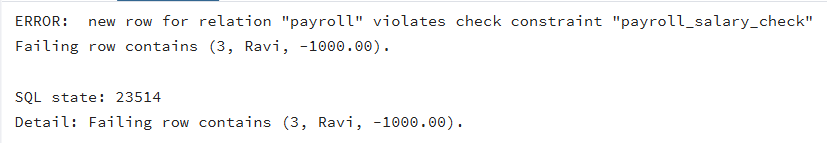
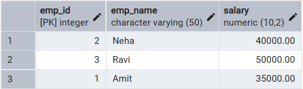

# 📘 Experiment 10: Transaction Control in SQL

## 🧑‍🎓 Student Information

*   **Name:** Prateek Verma
*   **UID:** 25MCC20062
*   **Branch:** MCA (CC & DEVOPS)
*   **Semester:** $II^{nd}$
*   **Section/Group:** 25MCC-101/A
*   **Subject:** Technical Training
*   **Subject Code:** 25CAP-652
*   **Date of Performance:** 21/04/2026

---

## 🎯 Aim

To implement **transaction control** mechanisms in PostgreSQL to ensure data integrity and consistency by enforcing ACID properties.
---

## 🧰 Software Requirements

*   **Database Server:** PostgreSQL
*   **Database Tool:** pgAdmin
*   **Operating System:** Windows

---

## ⚙️ Procedure

1.  Start the system.
2.  Open pgAdmin.
3.  Create and select the database in which you want to perform the experiment.
4.  Establish connection to the database using **Alt+Shift+Q**.
5.  Run the queries given in the Experiment Steps.

---

## 🗒️ Experiment Steps

```sql
BEGIN;
-- Update 1
UPDATE Payroll
SET salary = salary + 5000
WHERE emp_id = 1;

-- Savepoint
SAVEPOINT sp1;

-- Update 2
UPDATE Payroll
SET salary = salary + 7000
WHERE emp_id = 2;
```



```sql
-- Error simulation
UPDATE Payroll
SET salary = -1000
WHERE emp_id = 3;
```



```sql
-- Rollback to savepoint
ROLLBACK TO sp1;

-- Commit valid changes
COMMIT;
```



## 📥 Input / Output Details

*   **Input:** The input for the experiment consists of the SQL queries mentioned in the Experiment Steps.
*   **Output:** The output for each query is attached after the query itself

---

## 🎓 Learning Outcomes

*   Understanding of transactions in SQL.
*   Transaction Control Language commands.
*   Ensuring ACID properties using transactions.
