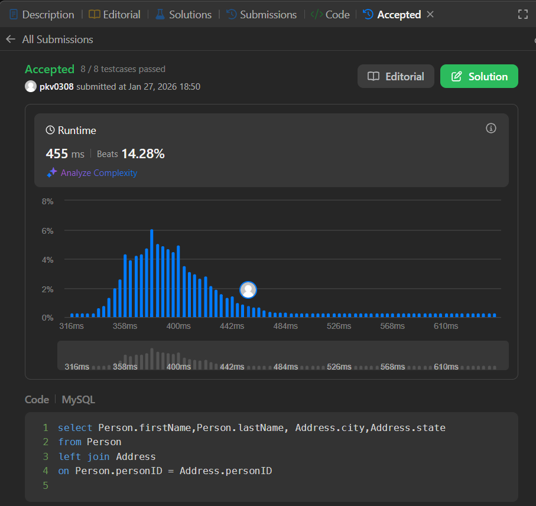

# 🧩 LeetCode 175: Combine Two Tables

## 📌 Problem Statement

Write an SQL query to report the **first name, last name, city, and state** of each person in the database.

If the address of a person is **not available**, return `NULL` for the city and state.

## 🗂️ Database Schema

### **Person** Table

| Column    | Type    |
| --------- | ------- |
| personId  | int     |
| lastName  | varchar |
| firstName | varchar |

* `personId` is the **primary key**.

### **Address** Table

| Column    | Type    |
| --------- | ------- |
| addressId | int     |
| personId  | int     |
| city      | varchar |
| state     | varchar |

* `addressId` is the **primary key**.
* `Address.personId` is a **foreign key** referencing `Person.personId`.


## 🎯 Expected Output

A table containing:

* `firstName`
* `lastName`
* `city`
* `state`

If a person does not have an address, `city` and `state` should be `NULL`.


## ✅ Solution

```sql
SELECT 
    p.firstName,
    p.lastName,
    a.city,
    a.state
FROM Person p
LEFT JOIN Address a
ON p.personId = a.personId;
```

## ✅ Submission Proof



