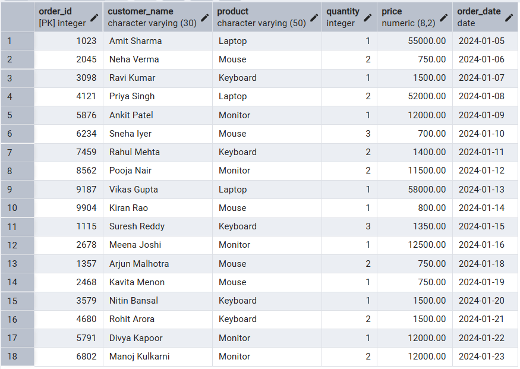
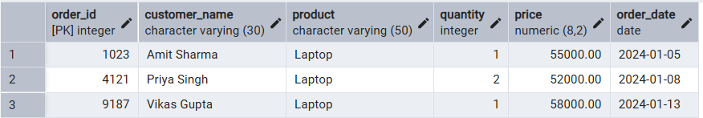
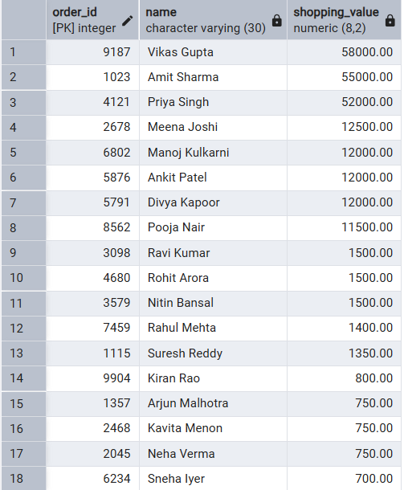
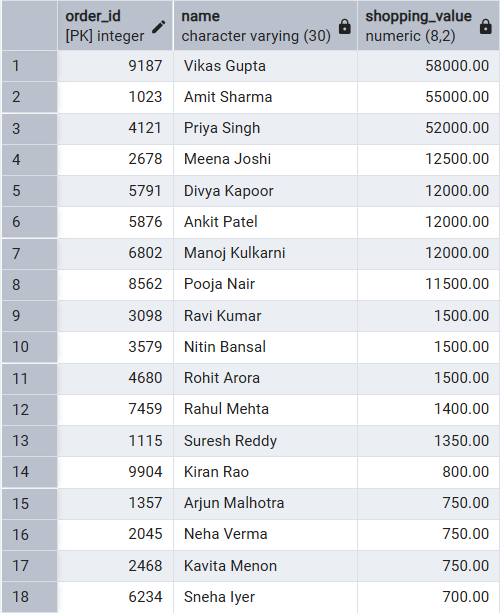
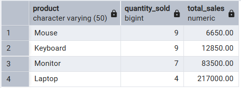
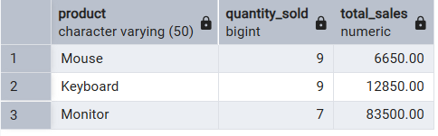
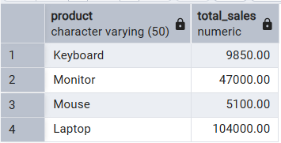
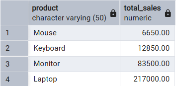

# 📘 Experiment 2: Implementation of SELECT Queries with Filtering, Grouping, and Sorting in PostgreSQL
## 🧑‍🎓 Student Information

* **Name:** Prateek Verma
* **UID:** 25MCC20062
* **Branch:** MCA (CC & DevOps)
* **Semester:** II
* **Section/Group:** 25MCC-101/A
* **Subject:** Technical Training
* **Subject Code:** 25CAP-652
* **Date of Performance:** 13/01/2026

## 🎯 Aim

To implement and analyze SQL `SELECT` queries using:

* Filtering conditions
* Sorting mechanisms
* Grouping and aggregation techniques

for efficient data retrieval and analytical reporting in PostgreSQL.

## 🧰 Software Requirements

* **Database Server:** PostgreSQL
* **Database Tool:** pgAdmin
* **Operating System:** Windows

## 🎯 Objectives

* Retrieve specific data using filtering conditions (`WHERE`)
* Sort query results using single and multiple attributes (`ORDER BY`)
* Perform aggregation using grouping techniques (`GROUP BY`)
* Apply conditions on aggregated data (`HAVING`)
* Understand real‑world analytical SQL queries

## ⚙️ Procedure

1. Start the system.
2. Open **pgAdmin**.
3. Create and select the required database.
4. Establish a connection using **Alt + Shift + Q**.
5. Execute the SQL queries listed in the experiment steps.

## 🗒️ Experiment Steps

### 1️⃣ Table Creation

```sql
CREATE TABLE customer_orders (
  order_id INT PRIMARY KEY,
  customer_name VARCHAR(30) NOT NULL,
  product VARCHAR(50) NOT NULL,
  quantity INT NOT NULL CHECK (quantity > 0),
  price DECIMAL(8,2) NOT NULL CHECK (price >= 0),
  order_date DATE NOT NULL
);
```

### 2️⃣ Insert Sample Data

```sql
INSERT INTO customer_orders VALUES
(1023, 'Amit Sharma', 'Laptop', 1, 55000.00, '2024-01-05');
```



### 3️⃣ Filtering Data (WHERE Clause)

```sql
SELECT * FROM customer_orders
WHERE price > 45000;
```


### 4️⃣ Sorting Query Results

#### 🔹 Descending Order Sorting

```sql
SELECT order_id, customer_name AS name, price AS shopping_value
FROM customer_orders
ORDER BY shopping_value DESC;
```


#### 🔹 Priority-Based Sorting

```sql
SELECT order_id, customer_name AS name, price AS shopping_value
FROM customer_orders
ORDER BY shopping_value DESC, order_id;
```


### 5️⃣ Grouping Data for Aggregation

```sql
SELECT product,
       COUNT(product) AS quantity_sold,
       SUM(quantity * price) AS total_sales
FROM customer_orders
GROUP BY product;
```


### 6️⃣ Applying Conditions on Aggregated Data (HAVING Clause)

```sql
SELECT product,
       SUM(quantity) AS quantity_sold,
       SUM(quantity * price) AS total_sales
FROM customer_orders
GROUP BY product
HAVING SUM(quantity) >= 5;
```


### 7️⃣ Filtering vs Aggregation Conditions

#### 🔸 Row-Level Filtering (WHERE)

```sql
SELECT product,
       SUM(quantity * price) AS total_sales
FROM customer_orders
WHERE quantity >= 2
GROUP BY product;
```


#### 🔸 Group-Level Filtering (HAVING)

```sql
SELECT product,
       SUM(quantity * price) AS total_sales
FROM customer_orders
GROUP BY product
HAVING SUM(quantity * price) > 50000;
```


## 📥 Input / Output Details

* **Input:** SQL queries executed as per the experiment steps.
* **Output:** Result sets generated after executing each query (attached with the experiment record).

## 🎓 Learning Outcomes

* Learned how to filter data to retrieve relevant records.
* Understood the importance of sorting in improving data readability.
* Gained hands-on experience with grouping and aggregation.
* Differentiated between row-level (`WHERE`) and group-level (`HAVING`) conditions.
* Developed the ability to write analytical SQL queries used in real-world applications.
* Improved preparedness for SQL-based academic and interview questions.
