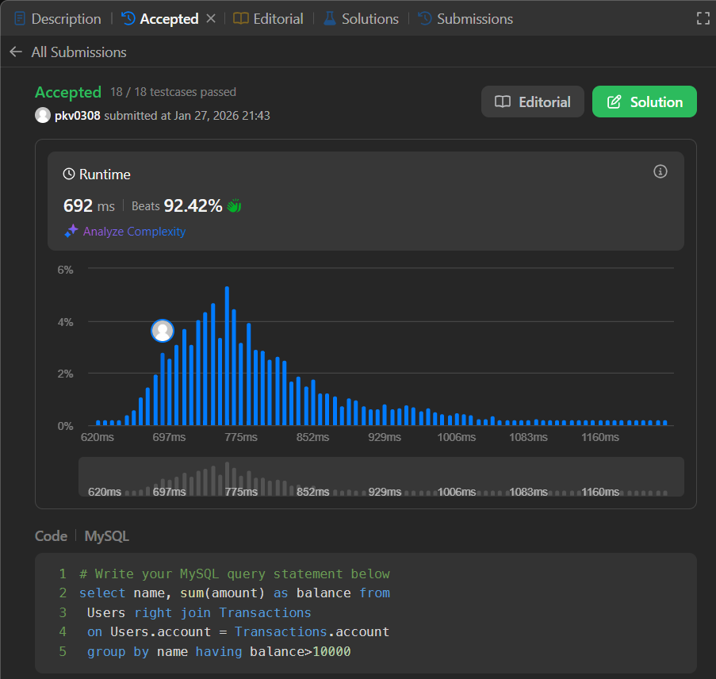

# 🧩 LeetCode 1587: Bank Account Summary II

## 📌 Problem Statement

Write an SQL query to report the **name and balance** of users whose **account balance is greater than 10000**.

The account balance is calculated as the **sum of all transaction amounts** for each account.

## 🗂️ Database Schema

### **Users** Table

| Column  | Type    |
| ------- | ------- |
| account | int     |
| name    | varchar |

* `account` is the **primary key**.

### **Transactions** Table

| Column   | Type |
| -------- | ---- |
| trans_id | int  |
| account  | int  |
| amount   | int  |

* `trans_id` is the **primary key**.
* `Transactions.account` is a **foreign key** referencing `Users.account`.
* `amount` can be **positive (deposit)** or **negative (withdrawal)**.

## 🎯 Expected Output

Return a table containing:

* `name`
* `balance`

Only include users whose **total balance > 10000**.

---

## ✅ Solution

```sql
select name, sum(amount) as balance from
 Users right join Transactions 
 on Users.account = Transactions.account 
 group by name having balance>10000 
```

## ✅ Submission Proof


