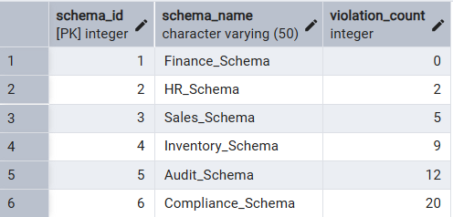
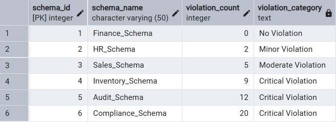
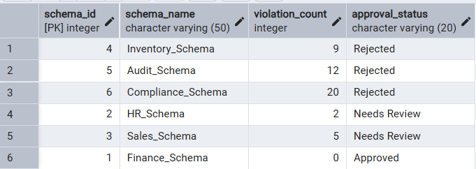
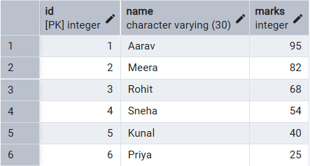
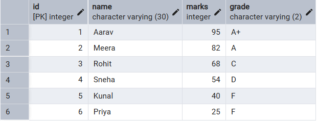
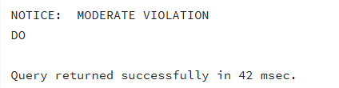

# 📘 Experiment 3: Implementation of Conditional Logic using IF–ELSE and CASE Statements in PostgreSQL


## 🧑‍🎓 Student Information

* **Name:** Prateek Verma
* **UID:** 25MCC20062
* **Branch:** MCA (CC & DevOps)
* **Semester:** II
* **Section/Group:** 25MCC-101/A
* **Subject:** Technical Training
* **Subject Code:** 25CAP-652
* **Date of Performance:** 27/01/2026

## 🎯 Aim

To implement conditional decision-making logic in PostgreSQL using IF–ELSE constructs and CASE expressions for classification, validation, and rule-based data processing.


## 🧰 Software Requirements

* **Database Server:** PostgreSQL
* **Database Tool:** pgAdmin
* **Operating System:** Windows


## 🎯 Objectives

* To understand conditional execution in SQL
* To implement decision-making logic using CASE expressions
* To simulate real-world rule validation scenarios
* To classify data based on multiple conditions
* To strengthen SQL logic skills required in interviews and backend systems


## ⚙️ Procedure

1. Start the system.
2. Open **pgAdmin**.
3. Create and select the required database.
4. Establish a connection using **Alt + Shift + Q**.
5. Execute the SQL queries listed in the experiment steps.

## 🗒️ Experiment Steps

### 1️⃣ Table Creation

```sql
CREATE TABLE schema_violations (
    schema_id int PRIMARY KEY,
    schema_name VARCHAR(50) NOT NULL,
    violation_count INT NOT NULL CHECK (violation_count >= 0)
);
```

### 2️⃣ Insert Sample Data

```sql
INSERT INTO schema_violations VALUES
(1,'Finance_Schema', 0);
```



### 3️⃣ Classifying Data using Case Expression

```sql
SELECT 
	*,
    CASE
        WHEN violation_count = 0 THEN 'No Violation'
        WHEN violation_count BETWEEN 1 AND 3 THEN 'Minor Violation'
        WHEN violation_count BETWEEN 4 AND 7 THEN 'Moderate Violation'
        ELSE 'Critical Violation'
    END AS violation_category
FROM schema_violations;
```


### 4️⃣ Applying Case Logic in Data Updates

#### 🔹 Alter table to add status attribute

```sql
ALTER TABLE schema_violations
ADD COLUMN approval_status VARCHAR(20);
```

#### 🔹 Updating status using case logic

```sql
UPDATE schema_violations
SET approval_status = CASE
    WHEN violation_count = 0 THEN 'Approved'
    WHEN violation_count BETWEEN 1 AND 7 THEN 'Needs Review'
    ELSE 'Rejected'
END;
```


### 5️⃣ Using case statement for custom sorting

```sql
SELECT * FROM schema_violations ORDER BY CASE 
WHEN approval_status='Rejected' THEN 1
WHEN approval_status='Needs Review' THEN 2
WHEN approval_status='Approved' THEN 3
END;
```


### 6️⃣ Real World Classification Scenario (Grading System)

### 🔹 Create table

```sql
CREATE TABLE students
(id INT PRIMARY KEY, name VARCHAR(30) NOT NULL, 
marks INT NOT NULL CHECK(marks<>0 AND marks<=100));
```

### 🔹 Insering Records

```sql
INSERT INTO students (id, name, marks) VALUES
(1, 'Aarav', 95);
```


### 🔹 Adding new grade column

```sql
ALTER TABLE students ADD column grade VARCHAR(2);
```
### 🔹 Updating grade column to reflec student grade based on marks using case statement

```sql
UPDATE  students SET
grade = CASE
        WHEN marks >= 90 THEN 'A+'
        WHEN marks >= 80 THEN 'A'
        WHEN marks >= 70 THEN 'B'
        WHEN marks >= 60 THEN 'C'
        WHEN marks >= 50 THEN 'D'
        ELSE 'F'
	END;
```



### 7️⃣ PL/pgSQL block to implement IF-ELSE logic


```sql
DO $$
DECLARE
    i INT := 7;
BEGIN
    IF i = 0 THEN
        RAISE NOTICE 'NO VIOLATION';
    ELSIF i <= 3 THEN
        RAISE NOTICE 'MINOR VIOLATION';
    ELSIF i <= 7 THEN
        RAISE NOTICE 'MODERATE VIOLATION';
    ELSE
        RAISE NOTICE 'CRITICAL VIOLATION';
    END IF;
END $$;
```



## 📥 Input / Output Details

* **Input:** SQL queries executed as per the experiment steps.
* **Output:** Result sets generated after executing each query (attached with the experiment record).

## 🎓 Learning Outcomes

* Learned how to filter data to retrieve relevant records.
* Understood the importance of sorting in improving data readability.
* Gained hands-on experience with grouping and aggregation.
* Differentiated between row-level (`WHERE`) and group-level (`HAVING`) conditions.
* Developed the ability to write analytical SQL queries used in real-world applications.
* Improved preparedness for SQL-based academic and interview questions.
