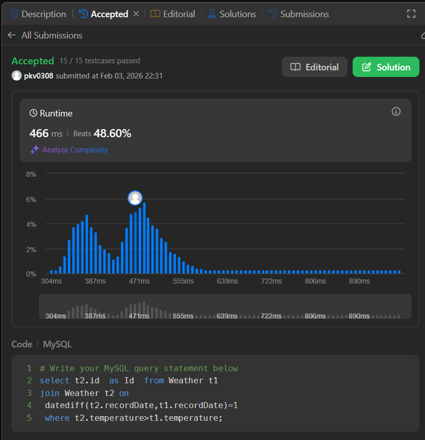

# 🌡️ LeetCode 197 – Rising Temperature

## 📘 Problem Statement

You are given a table **Weather** that stores daily temperature records.

### Table: `Weather`

| Column Name | Type |
| ----------- | ---- |
| id          | int  |
| recordDate  | date |
| temperature | int  |

* `id` is the **primary key**.
* Each row contains the temperature recorded on a specific date.

---

## 🎯 Objective

Write an SQL query to **find the IDs of dates** where the temperature was **higher than the previous day**.

---

## 📤 Output Format

Return a table with the following column:

| Column Name |
| ----------- |
| id          |

> 🔹 The order of the result does **not** matter.

## ✅ Solution

```sql
select t2.id  as Id  from Weather t1  
join Weather t2 on
 datediff(t2.recordDate,t1.recordDate)=1 
 where t2.temperature>t1.temperature;
```

## ✅ Submission Proof
