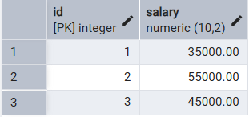

# 📘 Experiment 4: Implementation of Iterative Control Structures using FOR, WHILE, and LOOP in PostgreSQL

## 🧑‍🎓 Student Information

* **Name:** Prateek Verma
* **UID:** 25MCC20062
* **Branch:** MCA (CC & DevOps)
* **Semester:** II
* **Section/Group:** 25MCC-101/A
* **Subject:** Technical Training
* **Subject Code:** 25CAP-652
* **Date of Performance:** 03/02/2026

## 🎯 Aim

To understand and implement iterative control structures in PostgreSQL conceptually, including FOR loops, WHILE loops, and basic LOOP constructs, for repeated execution of database logic.

## 🧰 Software Requirements

* **Database Server:** PostgreSQL
* **Database Tool:** pgAdmin
* **Operating System:** Windows

## 🎯 Objectives

* To understand why iteration is required in database programming
* To learn the purpose and behavior of FOR, WHILE, and LOOP constructs
* To understand how repeated data processing is handled in databases
* To relate loop concepts to real-world batch processing scenarios
* To strengthen conceptual knowledge of procedural SQL used in enterprise systems.

## ⚙️ Procedure

1. Start the system.
2. Open **pgAdmin**.
3. Create and select the required database.
4. Establish a connection using **Alt + Shift + Q**.
5. Execute the SQL queries listed in the experiment steps.

## 🗒️ Experiment Steps

### 1️⃣ For Loop (simple iteration)

```sql
DO $$
BEGIN
    FOR i IN 1..5 LOOP
        RAISE NOTICE 'Number: %', i;
    END LOOP;
END $$;
```


### 2️⃣ For Loop with Query (Row-by-Row Processing)

```sql
DO $$
DECLARE
    rec RECORD;
BEGIN
    FOR rec in SELECT id, marks FROM "Experiment_3".students LOOP
        RAISE NOTICE 'ID: %, Marks: %',rec.id, rec.marks;
    END LOOP;
END $$;
```


### 3️⃣ While Loop (conditional iteration)

```sql
DO $$
DECLARE
    i int:=1;
BEGIN
    WHILE i<=5 LOOP
        RAISE NOTICE 'WHILE LOOP turn %',i;
        i:=i+1;
    END LOOP;
END $$
```


### 4️⃣ Loop with ‘EXIT WHEN’

```sql
DO $$
DECLARE
    i int :=1;
BEGIN
    LOOP
        RAISE NOTICE 'i=%',i;
        i:=i+1;
        EXIT WHEN i>5;
    END LOOP;
END $$;
```


### 5️⃣ Salary increment using For Loop

```sql
DO $$
DECLARE
    rec RECORD;
BEGIN
    FOR rec IN (SELECT id, salary from salaries)
    LOOP
        UPDATE salaries
        SET salary = rec.salary * 1.10
        WHERE id = rec.id;
    END LOOP;
END $$;
```

Before

After


### 6️⃣ Combining Loop with IF condition

```sql
DO $$
DECLARE
    rec RECORD;
BEGIN
    For rec in (select id, marks from "Experiment_3".students)
    LOOP
        IF rec.marks>50 THEN
        RAISE NOTICE 'ID: %, Marks: %',rec.id,rec.marks;
        END IF; 
    END LOOP;
END $$;
```


## 📥 Input / Output Details

* **Input:** SQL queries executed as per the experiment steps.
* **Output:** Result sets generated after executing each query (attached with the experiment record).

## 🎓 Learning Outcomes

* Understanding of how iterative control structures work in PostgreSQL at a conceptual level.
* Usage of loops in database systems, such as workflow engines, complex decision cycles, validation loops, etc.
* Foundational knowledge required for writing procedural logic in enterprise-grade applications.
