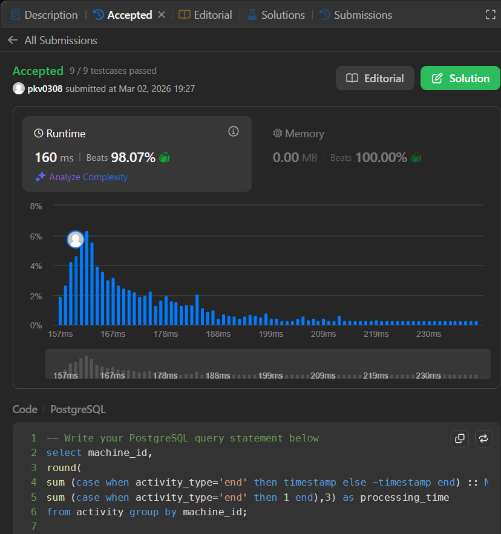

# 🏭 LeetCode 1661 – Average Time of Process per Machine

## 📘 Problem Statement

There is a factory website that has several machines each running the same number of processes. Write a solution to find the **average time** each machine takes to complete a process.

The time to complete a process is the `'end'` timestamp minus the `'start'` timestamp. The average time is calculated by the total time to complete every process on the machine divided by the number of processes that were run.

### Table: `Activity`

| Column Name | Type |
| --- | --- |
| machine_id | int |
| process_id | int |
| activity_type | enum |
| timestamp | float |

* `(machine_id, process_id, activity_type)` is the **primary key**.
* `activity_type` is an ENUM of type `('start', 'end')`.
* It is guaranteed that each `(machine_id, process_id)` pair has both a `'start'` and `'end'` timestamp, and the start always occurs before the end.

---

## 🎯 Objective

Find the `machine_id` along with the average time as `processing_time`, which should be **rounded to 3 decimal places**.

---

## 📤 Output Format

Return a table with the following columns:

| Column Name |
| --- |
| machine_id |
| processing_time |

> 🔹 The order of the result does **not** matter.

## ✅ Solution

```sql
select machine_id,
round(
sum (case when activity_type='end' then timestamp else -timestamp end) :: NUMERIC(20,3)/
sum (case when activity_type='end' then 1 end),3) as processing_time
from activity group by machine_id;

```

## ✅ Submission Proof



