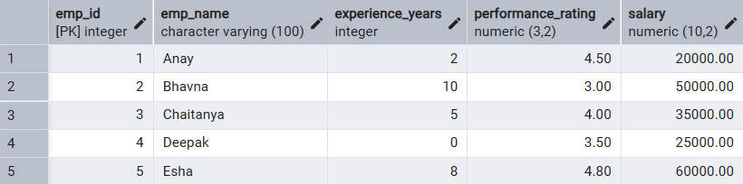
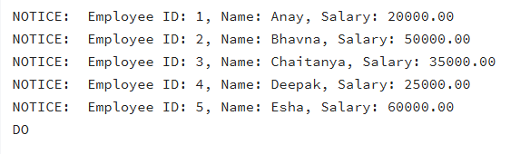
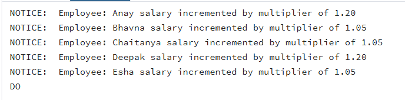
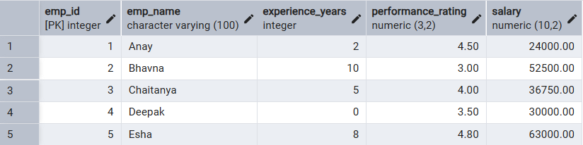
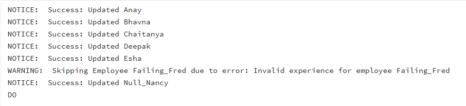
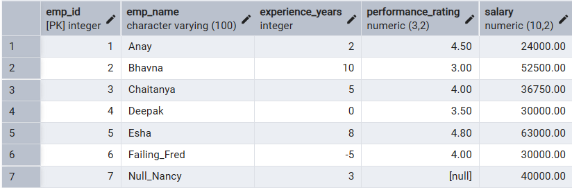
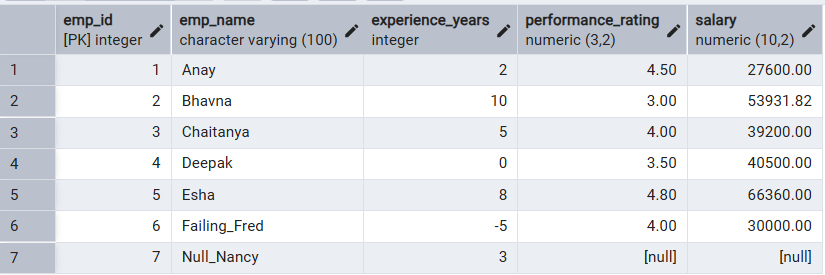

# 📘 Experiment 5: Creating and Using Cursors for Row-by-Row Processing in PostgreSQL

## 🧑‍🎓 Student Information

-   **Name:** Prateek Verma
-   **UID:** 25MCC20062
-   **Branch:** MCA (CC & DevOps)
-   **Semester:** II
-   **Section/Group:** 25MCC-101/A
-   **Subject:** Technical Training
-   **Subject Code:** 25CAP-652
-   **Date of Performance:** 17/02/2026

------------------------------------------------------------------------

## 🎯 Aim

To gain hands-on experience in creating and using cursors for row-by-row
processing in a database, enabling sequential access and manipulation of
query results for complex business logic.

------------------------------------------------------------------------

## 🧰 Software Requirements

-   **Database Server:** PostgreSQL\
-   **Database Tool:** pgAdmin\
-   **Operating System:** Windows

------------------------------------------------------------------------

## 🎯 Objectives

-   🔹 Sequential Data Access using cursors\
-   🔹 Row-Level Manipulation with conditional logic\
-   🔹 Resource Management (Declare, Open, Fetch, Close, Deallocate)\
-   🔹 Exception Handling in cursor processing

------------------------------------------------------------------------

## 📚 Theory

SQL is generally set-oriented, but some tasks require procedural
row-by-row processing using cursors.

### Cursor Types

-   **Implicit Cursor** -- Managed automatically by the system\
-   **Explicit Cursor** -- Defined by the developer\
-   **Forward-Only Cursor** -- Moves in one direction\
-   **Scrollable Cursor** -- Moves forward and backward

### Cursor Lifecycle

1.  DECLARE
2.  OPEN
3.  FETCH
4.  CLOSE
5.  DEALLOCATE

### Use Cases

-   Row-specific reports
-   Payroll updates
-   Data migration with validation
-   Complex conditional processing

------------------------------------------------------------------------

## ⚙️ Procedure

1.  Start the system.
2.  Open pgAdmin.
3.  Create and select the required database.
4.  Establish connection using Alt + Shift + Q.
5.  Execute the SQL queries listed below.

------------------------------------------------------------------------

## 🗒️ Experiment Steps

## Base Table


### 1️⃣ Simple Forward-Only Cursor

``` sql
DO $$  
DECLARE  
    emp_cursor CURSOR FOR SELECT emp_id, emp_name, salary FROM Employee; 
    emp_record RECORD; 
BEGIN  
    FOR emp_record IN emp_cursor LOOP 
        RAISE NOTICE 'Employee ID: %, Name: %, Salary: %',  
                     emp_record.emp_id,  
                     emp_record.emp_name,  
                     emp_record.salary; 
    END LOOP; 
END $$;
```


------------------------------------------------------------------------

### 2️⃣ Complex Salary Update using Cursor

``` sql
DO $$  
DECLARE  
    emp_cursor CURSOR FOR 
        SELECT emp_id, emp_name, experience_years, performance_rating, salary 
        FROM Employee; 

    emp_record RECORD; 
    v_ratio NUMERIC; 
    v_bonus_multiplier NUMERIC; 

BEGIN  
    FOR emp_record IN emp_cursor LOOP 

        v_ratio := emp_record.performance_rating / 
                   (emp_record.experience_years + 1); 

        IF v_ratio >= 1.5 THEN 
            v_bonus_multiplier := 1.20;  
        ELSIF v_ratio >= 0.8 THEN 
            v_bonus_multiplier := 1.10;  
        ELSE 
            v_bonus_multiplier := 1.05;  
        END IF; 

        UPDATE Employee  
        SET salary = salary * v_bonus_multiplier 
        WHERE emp_id = emp_record.emp_id; 

        RAISE NOTICE 'Employee: % salary incremented by multiplier of %',  
                     emp_record.emp_name,  
                     v_bonus_multiplier; 

    END LOOP;  
END $$;
```


------------------------------------------------------------------------

### 3️⃣ Cursor with Exception Handling

``` sql
DO $$ 
DECLARE  
    emp_cursor CURSOR FOR SELECT * FROM Employee; 
    emp_record RECORD; 
    v_ratio NUMERIC; 
BEGIN  

    OPEN emp_cursor; 

    LOOP 
        FETCH emp_cursor INTO emp_record; 
        EXIT WHEN NOT FOUND;  

        BEGIN 
            IF emp_record.experience_years < 0 THEN 
                RAISE EXCEPTION 
                'Invalid experience for employee %', 
                emp_record.emp_name; 
            END IF; 

            v_ratio := emp_record.performance_rating / 
                       (emp_record.experience_years + 1); 

            UPDATE Employee  
            SET salary = salary * (1 + (v_ratio / 10)) 
            WHERE emp_id = emp_record.emp_id; 

            RAISE NOTICE 'Success: Updated %', 
                         emp_record.emp_name; 

        EXCEPTION  
            WHEN OTHERS THEN 
                RAISE WARNING 
                'Skipping Employee % due to error: %', 
                emp_record.emp_name, 
                SQLERRM; 
        END; 

    END LOOP; 

    CLOSE emp_cursor; 

EXCEPTION  
    WHEN OTHERS THEN  
        RAISE EXCEPTION 
        'Critical Failure in Cursor Processing: %', 
        SQLERRM; 
END $$;
```



Before:


After:


------------------------------------------------------------------------

## 📥 Input / Output Details

-   **Input:** SQL queries executed as per experiment steps
-   **Output:** Console messages and updated table records

------------------------------------------------------------------------

## 🎓 Learning Outcomes

-   Ability to implement and manage cursors
-   Understanding cursor lifecycle
-   Proper exception handling in procedural SQL
-   Application of cursor logic in real-world scenarios
