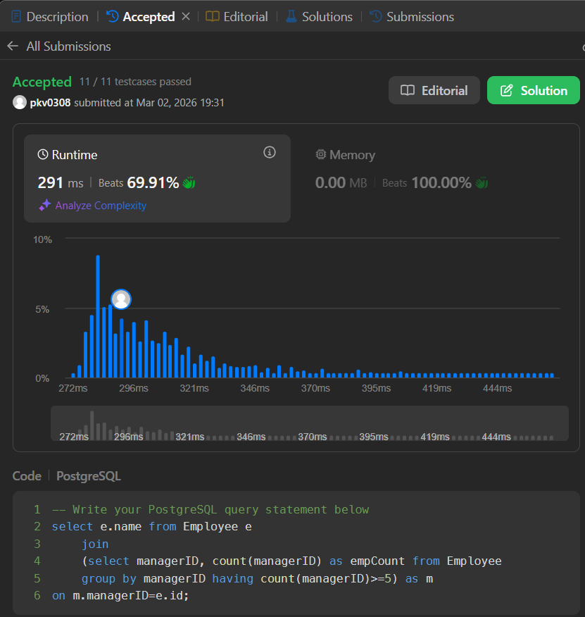

# 👥 LeetCode 570 – Managers with at Least 5 Direct Reports

## 📘 Problem Statement

You are given a table **Employee** that contains information about employees and their managers.

### Table: `Employee`

| Column Name | Type |
| --- | --- |
| id | int |
| name | varchar |
| department | varchar |
| managerId | int |

* `id` is the **primary key** for this table.
* Each row indicates the name of an employee, their department, and the **id of their manager**.
* If `managerId` is null, then the employee does not have a manager.
* No employee will be the manager of themself.

---

## 🎯 Objective

Write a solution to find managers who have at least **five direct reports**.

---

## 📤 Output Format

Return a table with the following column:

| Column Name |
| --- |
| name |

> 🔹 The order of the result does **not** matter.

## ✅ Solution

```sql
select e.name from Employee e 
	join 
	(select managerID, count(managerID) as empCount from Employee 
	group by managerID having count(managerID)>=5) as m 
on m.managerID=e.id;    

```

## ✅ Submission Proof



