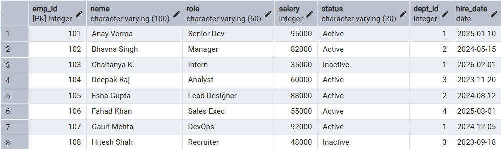
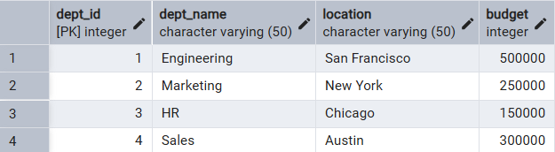
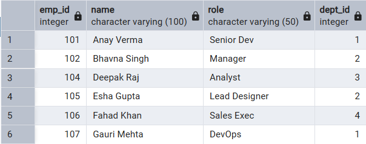
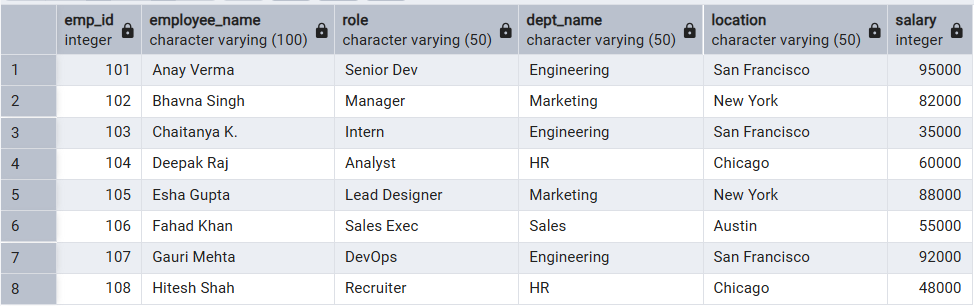
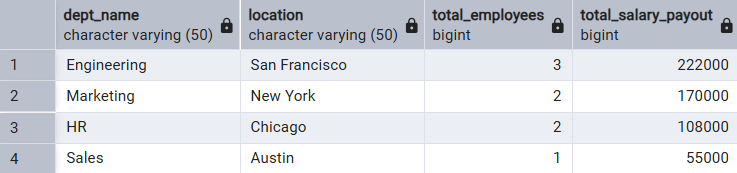

# 📘 Experiment 6: Views in SQL Databases

## 🧑‍🎓 Student Information

-   **Name:** Prateek Verma
-   **UID:** 25MCC20062
-   **Branch:** MCA (CC & DevOps)
-   **Semester:** II
-   **Section/Group:** 25MCC-101/A
-   **Subject:** Technical Training
-   **Subject Code:** 25CAP-652
-   **Date of Performance:** 24/02/2026

------------------------------------------------------------------------

## 🎯 Aim

To learn how to create, query, and manage views in SQL to simplify
database queries and provide a layer of abstraction for end-users.

------------------------------------------------------------------------

## 🧰 Software Requirements

-   **Database Server:** PostgreSQL
-   **Database Tool:** pgAdmin
-   **Operating System:** Windows

------------------------------------------------------------------------

## 🎯 Objectives

-   🔹 Data Abstraction using virtual tables
-   🔹 Enhanced Security through restricted data access
-   🔹 Query Simplification using pre-joined tables
-   🔹 View Management (Create, Alter, Drop)

------------------------------------------------------------------------

## 📚 Theory

A **View** is a virtual table based on the result set of an SQL
statement. It does not store data physically but retrieves it
dynamically from base tables.

### Types of Views

-   **Simple Views** -- Created from a single table without grouping or
    aggregates (often updatable).
-   **Complex Views** -- Created using JOINs, GROUP BY, or aggregate
    functions.
-   **Security-Based Views** -- Used to restrict sensitive columns in
    enterprise systems.

### Benefits of Views

-   Simplifies user experience
-   Ensures data consistency across reports
-   Provides abstraction layer
-   Reduces accidental data modification

------------------------------------------------------------------------

## ⚙️ Procedure

1.  Start the system.
2.  Open pgAdmin.
3.  Create and select the required database.
4.  Establish connection using Alt + Shift + Q.
5.  Execute the SQL queries listed below.

------------------------------------------------------------------------

## 🗒️ Experiment Steps

### 📌 Base Tables

-   **Employees**

-   **Departments**


------------------------------------------------------------------------

### 1️⃣ Creating a Simple View

``` sql
CREATE VIEW Active_Employees_List AS
SELECT emp_id,
       name,
       role,
       dept_id
FROM Employees
WHERE status = 'Active';
```

------------------------------------------------------------------------

### 2️⃣ Creating a View with JOIN (Multi-Table View)

``` sql
CREATE VIEW Employee_Department_Details AS
SELECT e.emp_id,
       e.name AS employee_name,
       e.role,
       d.dept_name,
       d.location,
       e.salary
FROM Employees e
JOIN Departments d ON e.dept_id = d.dept_id;
```


------------------------------------------------------------------------

### 3️⃣ Creating an Advanced Aggregated View

``` sql
CREATE VIEW Department_Summary AS
SELECT d.dept_name,
       d.location,
       COUNT(e.emp_id) AS total_employees,
       SUM(e.salary) AS total_salary_payout
FROM Departments d
LEFT JOIN Employees e ON d.dept_id = e.dept_id
GROUP BY d.dept_id,
         d.dept_name,
         d.location,
         d.budget;
```


------------------------------------------------------------------------

## 📥 Input / Output Details

-   **Input:** SQL queries executed as per experiment steps
-   **Output:** Views created successfully and queried to display
    structured results

------------------------------------------------------------------------

## 🎓 Learning Outcomes

-   Ability to create and manage SQL views
-   Understanding abstraction and security implementation using views
-   Correct syntax usage for simple and complex views
-   Designing practical real-world database view structures (e.g.,
    Payroll or Library Systems)
