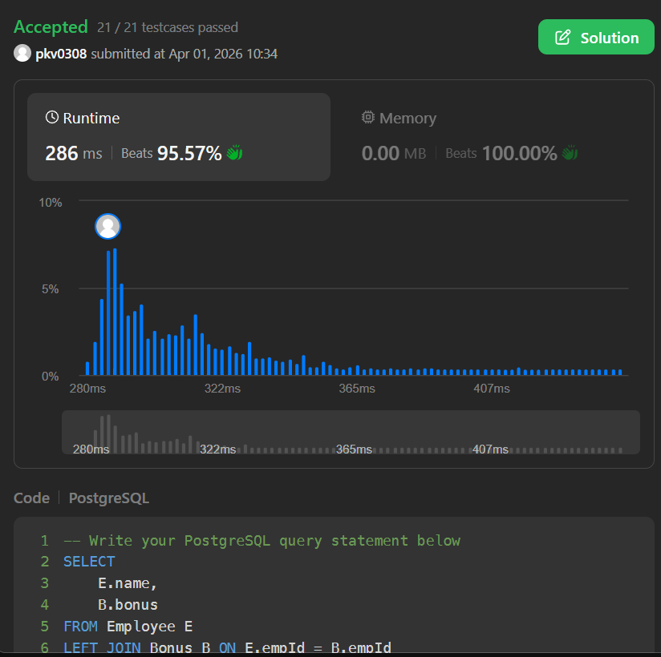

# 💰 LeetCode 577 -- Employee Bonus

## 📘 Problem Statement

You are given two tables: **Employee** and **Bonus**.

### Table: `Employee`

| Column Name | Type |
| --- | --- |
| empId | int |
| name | varchar |
| supervisor | int |
| salary | int |

-   `empId` is the **primary key**.
-   Each row contains information about an employee.

### Table: `Bonus`

| Column Name | Type |
| --- | --- |
| empId | int |
| bonus | int |


-   `empId` is a **foreign key** referring to `Employee.empId`.
-   Each row contains the bonus of an employee.


## 🎯 Objective

Write a query to report the **name and bonus amount** of each employee
with a bonus **less than 1000**.

If an employee does not have a bonus, include them with a **NULL**
value.


## 📤 Output Format
Return a table with the following column:

| Column Name |
| --- |
| name |
| bonus |
  
> 🔹 The order of the result does **not** matter.

## ✅ Solution

``` sql
SELECT 
    E.name, 
    B.bonus
FROM Employee E
LEFT JOIN Bonus B ON E.empId = B.empId
WHERE B.bonus < 1000 OR B.bonus IS NULL;
```


## ✅ Submission Proof


