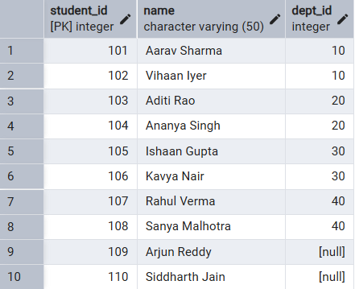
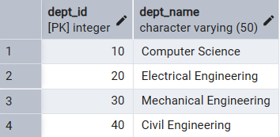
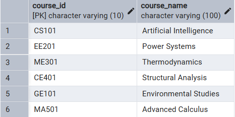
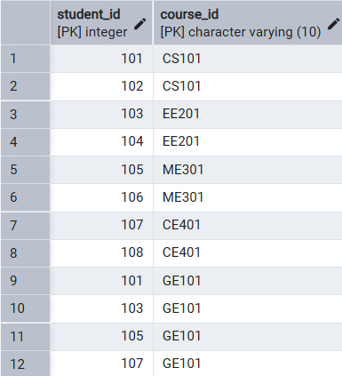
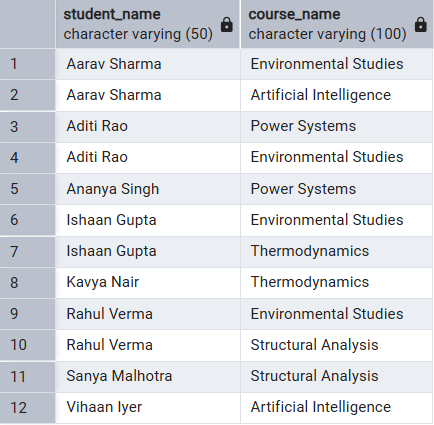
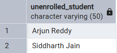
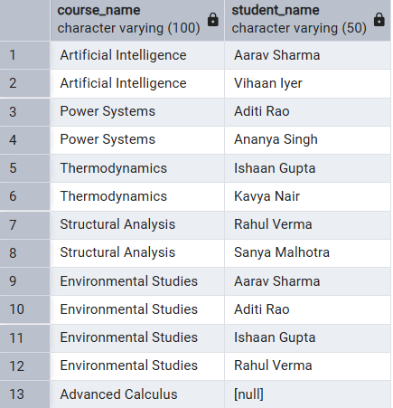
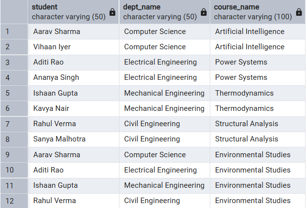
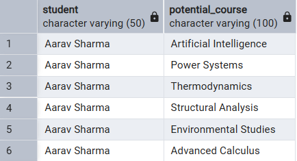
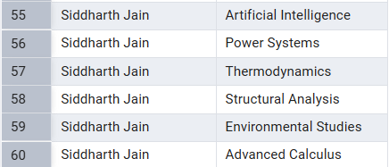

# 📘 Experiment 7:  Joins in SQL

## 🧑‍🎓 Student Information

-   **Name:** Prateek Verma
-   **UID:** 25MCC20062
-   **Branch:** MCA (CC & DevOps)
-   **Semester:** II
-   **Section/Group:** 25MCC-101/A
-   **Subject:** Technical Training
-   **Subject Code:** 25CAP-652
-   **Date of Performance:** 31/03/2026

------------------------------------------------------------------------

## 🎯 Aim

Implementation of joins in PostgreSQL (inner join, left join, right join, self-join and cross join)database queries and provide a layer of abstraction for end-users.

------------------------------------------------------------------------

## 🧰 Software Requirements

-   **Database Server:** PostgreSQL
-   **Database Tool:** pgAdmin
-   **Operating System:** Windows

------------------------------------------------------------------------


## ⚙️ Procedure

1.  Start the system.
2.  Open pgAdmin.
3.  Create and select the required database.
4.  Establish connection using Alt + Shift + Q.
5.  Execute the SQL queries listed below.

------------------------------------------------------------------------

## 🗒️ Experiment Steps

### 📌 Base Tables

-   **students**



-   **Departments**



-   **Courses**



-   **Enrollments**



------------------------------------------------------------------------

### 1️⃣ Query to list students with their enrolled courses

``` sql
SELECT S.Name AS Student_Name, C.Course_Name FROM Students S
INNER JOIN Enrollments E ON S.Student_ID = E.Student_ID
INNER JOIN Courses C ON E.Course_ID = C.Course_ID
ORDER BY S.Name;
```


------------------------------------------------------------------------

### 2️⃣ Query to find students not enrolled in any course

``` sql
SELECT S.Name AS Unenrolled_Student FROM Students S
LEFT JOIN Enrollments E ON S.Student_ID = E.Student_ID
WHERE E.Course_ID IS NULL;
```


------------------------------------------------------------------------

### 3️⃣ Query to display all courses with or without enrolled students

``` sql
SELECT C.Course_Name, S.Name AS Student_Name
FROM Enrollments E JOIN Students S ON E.Student_ID = S.Student_ID
RIGHT JOIN Courses C ON E.Course_ID = C.Course_ID;
```


------------------------------------------------------------------------
### 4️⃣ Query to show students with department info

``` sql
SELECT C.Course_Name, S.Name AS Student_Name
FROM Enrollments E JOIN Students S ON E.Student_ID = S.Student_ID
RIGHT JOIN Courses C ON E.Course_ID = C.Course_ID;
```


------------------------------------------------------------------------
### 5️⃣ Query to display all possible student-course combinations

``` sql
SELECT C.Course_Name, S.Name AS Student_Name
FROM Enrollments E JOIN Students S ON E.Student_ID = S.Student_ID
RIGHT JOIN Courses C ON E.Course_ID = C.Course_ID;
```

...



------------------------------------------------------------------------

## 📥 Input / Output Details

-   **Input:** SQL queries executed as per experiment steps
-   **Output:** Views created successfully and queried to display
    structured results

------------------------------------------------------------------------

## 🎓 Learning Outcomes

-  Understanding of the JOINS in SQL.
-   Implementing referential integrity in SQL using foreign keys.
-   Understanding of data relationships.
