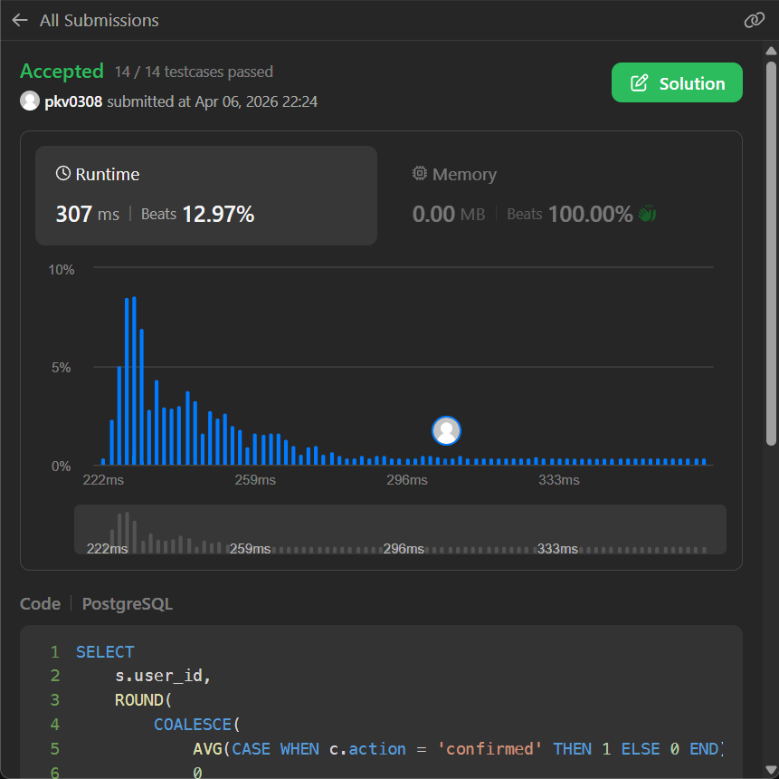

## 💰 LeetCode 1934 -- Confirmation Rate

## 📘 Problem Statement

You are given two tables: **Signups** and **Confirmations**.

### Table: `Signups`

| Column Name | Type |
| :--- | :--- |
| user\_id | int |
| time\_stamp | datetime |

  - `user_id` is the **primary key**.
  - Each row contains information about the signup time for a user.

### Table: `Confirmations`

| Column Name | Type |
| :--- | :--- |
| user\_id | int |
| time\_stamp | datetime |
| action | ENUM |

  - `(user_id, time_stamp)` is the **primary key**.
  - `user_id` is a **foreign key** referring to `Signups.user_id`.
  - `action` is an ENUM of type ('confirmed', 'timeout').

## 🎯 Objective

The **confirmation rate** of a user is the number of 'confirmed' messages divided by the total number of requested confirmation messages. The confirmation rate of a user that did not request any confirmation messages is $0$. Round the confirmation rate to **two decimal places**.

Write a query to find the **confirmation rate** of each user.

## 📤 Output Format

Return the result table in any order:

| Column Name | Type |
| :--- | :--- |
| user\_id | int |
| confirmation\_rate | decimal |

-----

## ✅ Solution (PostgreSQL)

In PostgreSQL, we use `COALESCE` to handle users with no requests and a `CASE` statement to convert the text actions into numeric values for averaging.

```sql
SELECT 
    s.user_id, 
    ROUND(
        COALESCE(AVG(CASE WHEN c.action = 'confirmed' THEN 1 ELSE 0 END), 0), 2) AS confirmation_rate
FROM Signups s LEFT JOIN Confirmations c ON s.user_id = c.user_id
GROUP BY 
    s.user_id;
```

-----

## ✅ Submission Proof

