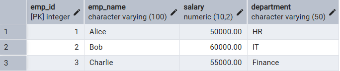
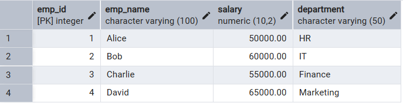
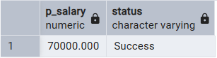
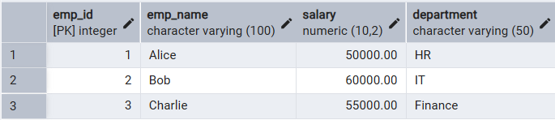
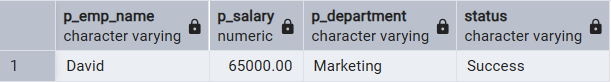

# 📘 Experiment 8: Stored Procedures in SQL

## 🧑‍🎓 Student Information

*   **Name:** Prateek Verma
*   **UID:** 25MCC20062
*   **Branch:** MCA (CC & DEVOPS)
*   **Semester:** $II^{nd}$
*   **Section/Group:** 25MCC-101/A
*   **Subject:** Technical Training
*   **Subject Code:** 25CAP-652
*   **Date of Performance:** 31/03/2026

---

## 🎯 Aim

To apply the concept of **Stored Procedures** in database operations in order to perform tasks like insertion, updating, deletion, and retrieval of data efficiently, securely, and in a reusable manner within the database system.

---

## 🧰 Software Requirements

*   **Database Server:** PostgreSQL
*   **Database Tool:** pgAdmin
*   **Operating System:** Windows

---

## ⚙️ Procedure

1.  Start the system.
2.  Open pgAdmin.
3.  Create and select the database in which you want to perform the experiment.
4.  Establish connection to the database using **Alt+Shift+Q**.
5.  Run the queries given in the Experiment Steps.

---

## 🗒️ Experiment Steps

### 📌 Base Table: `Employees`



---

### 1️⃣ Procedure to Insert Employee Data

```sql
CREATE OR REPLACE PROCEDURE INSERT_EMPLOYEE_PROC (
    IN P_EMP_ID INT,
    IN P_EMP_NAME VARCHAR(100),
    IN P_SALARY NUMERIC (10,2),
    IN P_DEPARTMENT VARCHAR(50),
    OUT STATUS VARCHAR(50)
) AS $$BEGIN
    INSERT INTO EMPLOYEES (EMP_ID, EMP_NAME, SALARY, DEPARTMENT)
    VALUES (P_EMP_ID, P_EMP_NAME, P_SALARY, P_DEPARTMENT);
    STATUS := 'Success';
EXCEPTION
    WHEN unique_violation THEN
        STATUS := 'Error: Employee ID already exists';
    WHEN not_null_violation THEN
        STATUS := 'Error: Missing required fields';
    WHEN OTHERS THEN
        STATUS := 'Error: ' || SQLERRM;
END;$$ LANGUAGE PLPGSQL;

CALL INSERT_EMPLOYEE_PROC(4, 'David', 65000, 'Marketing', NULL);
```



---

### 2️⃣ Procedure to Update Employee Salary

```sql
CREATE OR REPLACE PROCEDURE UPDATE_SALARY_PROC (
    IN P_EMP_ID INT,
    INOUT P_SALARY NUMERIC(20, 3),
    OUT STATUS VARCHAR(20)
) AS $$DECLARE
    CURR_SAL NUMERIC(20, 3);
BEGIN
    SELECT SALARY + P_SALARY INTO CURR_SAL
    FROM EMPLOYEES
    WHERE EMP_ID = P_EMP_ID;
    
    IF NOT FOUND THEN 
        RAISE EXCEPTION 'Employee Not Found';
    END IF;

    UPDATE EMPLOYEES
    SET SALARY = CURR_SAL
    WHERE EMP_ID = P_EMP_ID;

    STATUS := 'Success';
    P_SALARY := CURR_SAL;
EXCEPTION 
    WHEN OTHERS THEN 
        IF SQLERRM LIKE '%Employee Not Found%' THEN 
            STATUS := 'Employee Not Found';
        END IF;
END;$$ LANGUAGE PLPGSQL;

CALL UPDATE_SALARY_PROC(4, 5000.00, NULL);
```



---

### 3️⃣ Procedure to Delete Employee

```sql
CREATE OR REPLACE PROCEDURE DELETE_EMPLOYEE_PROC (
    IN P_EMP_ID INT,
    OUT STATUS VARCHAR(50)
) AS $$DECLARE
    V_DELETED_ROWS INT;
BEGIN
    DELETE FROM EMPLOYEES
    WHERE EMP_ID = P_EMP_ID;
    
    GET DIAGNOSTICS V_DELETED_ROWS = ROW_COUNT;
    
    IF V_DELETED_ROWS = 0 THEN
        STATUS := 'Employee Not Found';
    ELSE
        STATUS := 'Success';
    END IF;
EXCEPTION
    WHEN OTHERS THEN
        STATUS := 'Error: ' || SQLERRM;
END;$$ LANGUAGE PLPGSQL;

CALL DELETE_EMPLOYEE_PROC(4, NULL);
```



---

### 4️⃣ Procedure to Retrieve Employee Row

```sql
CREATE OR REPLACE PROCEDURE GET_EMPLOYEE_PROC (
    IN P_EMP_ID INT,
    OUT P_EMP_NAME VARCHAR(100),
    OUT P_SALARY NUMERIC(10,2),
    OUT P_DEPARTMENT VARCHAR(50),
    OUT STATUS VARCHAR(50)
) AS $$BEGIN
    SELECT EMP_NAME, SALARY, DEPARTMENT
    INTO P_EMP_NAME, P_SALARY, P_DEPARTMENT
    FROM EMPLOYEES
    WHERE EMP_ID = P_EMP_ID;

    IF NOT FOUND THEN
        STATUS := 'Employee Not Found';
        P_EMP_NAME := NULL; P_SALARY := NULL; P_DEPARTMENT := NULL;
    ELSE
        STATUS := 'Success';
    END IF;
EXCEPTION
    WHEN OTHERS THEN
        STATUS := 'Error: ' || SQLERRM;
        P_EMP_NAME := NULL; P_SALARY := NULL; P_DEPARTMENT := NULL;
END;$$ LANGUAGE PLPGSQL;

CALL GET_EMPLOYEE_PROC(1, NULL, NULL, NULL, NULL);
```



---

## 📥 Input / Output Details

*   **Input:** The input for the experiment consists of the SQL queries mentioned in the Experiment Steps.
*   **Output:** The output for each query (status messages and updated table states) is captured following the procedure calls.

---

## 🎓 Learning Outcomes

*   Understanding how to create procedures in SQL.
*   Handling errors within SQL procedures using exception blocks.
*   Utilizing **IN**, **OUT**, and **INOUT** variables in SQL procedures.
*   Executing procedures using the **CALL** statement.