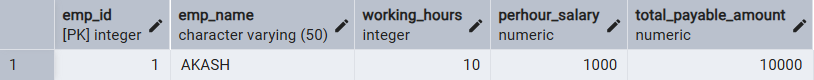
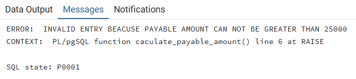

# 📘 Experiment 9: Triggers in SQL

## 🧑‍🎓 Student Information

*   **Name:** Prateek Verma
*   **UID:** 25MCC20062
*   **Branch:** MCA (CC & DEVOPS)
*   **Semester:** $II^{nd}$
*   **Section/Group:** 25MCC-101/A
*   **Subject:** Technical Training
*   **Subject Code:** 25CAP-652
*   **Date of Performance:** 07/04/2026

---

## 🎯 Aim

To implement **database triggers** in PostgreSQL to automatically calculate values and enforce constraints during data insertion operations.

---

## 🧰 Software Requirements

*   **Database Server:** PostgreSQL
*   **Database Tool:** pgAdmin
*   **Operating System:** Windows

---

## ⚙️ Procedure

1.  Start the system.
2.  Open pgAdmin.
3.  Create and select the database in which you want to perform the experiment.
4.  Establish connection to the database using **Alt+Shift+Q**.
5.  Run the queries given in the Experiment Steps.

---

## 🗒️ Experiment Steps

### 1️⃣ Creating trigger function

```sql
CREATE OR REPLACE FUNCTION CACULATE_PAYABLE_AMOUNT() RETURNS TRIGGER
AS
$$
BEGIN
NEW.total_payable_amount:=NEW.perhour_salary*New.working_hours;
IF NEW.total_payable_amount>25000 THEN
RAISE EXCEPTION 'INVALID ENTRY BEACUSE PAYABLE AMOUNT CAN NOT BE GREATER THAN 25000';
END IF;
RETURN NEW;
END;
$$ LANGUAGE PLPGSQL;
```

---

### 2️⃣ Creating trigger

```sql
CREATE OR REPLACE TRIGGER AUTOMATED_PAYABLE_AMOUNT_CALCULATION
BEFORE INSERT
ON employee
FOR EACH ROW
EXECUTE FUNCTION CACULATE_PAYABLE_AMOUNT()
```

---

### 3️⃣ Inserting valid data

```sql
INSERT INTO EMPLOYEE(EMP_ID, EMP_NAME,working_hours,perhour_salary) VALUES (1, 'AKASH',10,1000)
```



---

### 4️⃣ Inserting invalid data

```sql
insert into employee(emp_id, emp_name, working_hours, perhour_salary) values (2,'Ankush',8,100000)
```



---

## 📥 Input / Output Details

*   **Input:** The input for the experiment consists of the SQL queries mentioned in the Experiment Steps.
*   **Output:** The output for each query is attached after the query itself

---

## 🎓 Learning Outcomes

*   Create and use triggers in PostgreSQL.
*   Use triggers for automation in SQL.
*   Enforce constraints using trigger conditions.
*   Real-time execution of database logic.