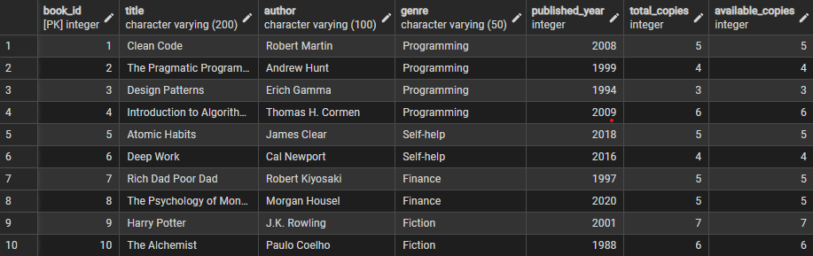
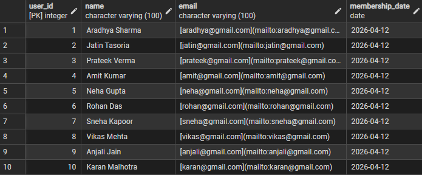
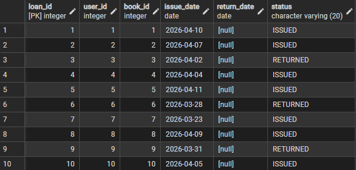
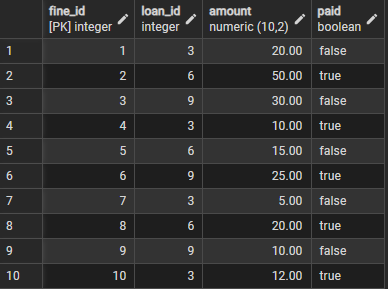

# Project Report - Library Management System

## Technical Training (25CAP-652)

### Submitted by

- Aradhya Sharma  
- Jatin Tasoria  
- Prateek Verma  

### Under the guidance of

**Mr. Shalabh Bhatiya**

### In partial fulfilment for the award of the degree of

**Master of Computer Application**  
**Cloud Computing and DevOps**

### Chandigarh University

**April 2026**

---

# CERTIFICATE

This is to certify that Aradhya Sharma, Jatin Tasoria, and Prateek Verma, students of Master of Computer Applications (MCA), have successfully completed the Mini Project titled **"Library Management System"** under the esteemed guidance of Mr. Shalabh Bhatiya, Assistant Professor, Chandigarh University.

This project was undertaken as a part of the academic curriculum and is submitted in partial fulfilment of the requirements for the MCA program. The work presented in this project is a result of independent research, diligent effort, and dedication, demonstrating the student's ability to apply theoretical database concepts to practical problem-solving.

The project is a robust relational database application that integrates complex SQL queries, data normalization, PL/pgSQL stored procedures, and automated triggers. It effectively showcases concepts of Database Management Systems (DBMS), entity-relationship modeling, and query optimization.

I hereby confirm that this project was originally carried out by the students and has not been submitted elsewhere for the award of any other degree, diploma, or certification.

**Mr. Shalabh Bhatiya**  
Project Guide & Assistant Professor  
Chandigarh University

---

# ACKNOWLEDGEMENT

We would like to express our sincere gratitude to Chandigarh University and the University Institute of Computing (UIC) for providing us with the opportunity to undertake this project, **"Library Management System"**.

We extend our heartfelt appreciation to our esteemed mentor, Mr. Shalabh Bhatiya, for their invaluable guidance, continuous support, and insightful feedback throughout the project. Their expertise in Database Management Systems played a crucial role in the successful completion of this work.

We are also sincerely thankful to the department for providing the facilities and learning environment, including lab sessions and academic support, that made this project possible.

Through this work, we have gained practical knowledge and confidence in designing and managing relational databases, which will be immensely useful in our future career endeavors.

- Aradhya Sharma (25MCC20042)  
- Jatin Tasoria (25MCC20054)  
- Prateek Verma (25MCC20062)

MCA Cloud Computing & DevOps  
Chandigarh University

---

# TABLE OF CONTENTS

| S. No | Particulars | 
|------|-------------|
| 1 | Abstract | 
| 2 | Problem Statement | 
| 3 | Introduction | 
| 4 | Aim of the Project | 
| 5 | Technologies Used | 
| 6 | Implementation | 
| 7 | Results | 
| 8 | Output | 
| 9 | Future Development | 
| 10 | Conclusion | 
| 11 | Learning Outcomes | 
| 12 | References | 

---

# 1. Abstract

The **"Library Management System"** is a relational database project designed to demonstrate the principles of data modeling, normalization, and efficient data retrieval. Developed as part of the DBMS curriculum, this project leverages PostgreSQL to construct a robust and scalable backend infrastructure for managing library operations.

The core architecture consists of interconnected relational tables handling data for books, members, borrowing records, and fines. To ensure data integrity, primary and foreign key constraints are strictly enforced. Moving beyond basic CRUD operations, the system successfully automates routine tasks through the implementation of PL/pgSQL stored procedures and triggers—such as automatically adjusting inventory counts upon checkout and automatically calculating late penalties.

Ultimately, this implementation bridges theoretical database concepts with practical scenarios, showcasing how modern institutions maintain organized, automated, and accessible data repositories.

---

# 2. Problem Statement

Traditional, manual methods of managing library records rely heavily on physical ledgers and paper-based tracking. This approach is highly inefficient, prone to human error, and poses a significant risk of data loss or inconsistency.

Furthermore, manually searching for book availability, tracking overdue returns, and calculating fine accumulations are time-consuming processes that scale poorly as a library's collection and membership base grow.

There is a critical need for a digitized, structured database architecture that can handle these operations automatically. This project solves these legacy issues by implementing a centralized Relational Database Management System (RDBMS). By utilizing structured SQL schemas, advanced window functions, and automated triggers, the system instantly processes complex queries, eliminates data redundancy, and ensures that administrators have real-time, accurate access to all inventory and member activity.

---

# 3. Introduction

In any educational or public institution, the efficient management of information is a foundational requirement. The **"Library Management System"** was developed to address the specific data handling demands of a modern library utilizing advanced relational database techniques.

This project transitions from conventional file-system data storage to a highly structured, automated database environment. By logically separating entities into specific tables (users, books, loans, and fines), the system ensures robust data normalization.

The database utilizes advanced SQL concepts—including multi-table joins, subqueries, views, and aggregate functions—to provide administrative users with a comprehensive toolset for querying information.

Most notably, the architecture employs event-driven database triggers, ensuring the system remains self-updating and maintaining strict referential integrity without requiring manual administrative intervention for every transaction.

---

# 4. Aim of the Project

## Primary Aim

To design and implement a robust Relational Database Management System for a library that demonstrates effective schema design, data normalization, complex SQL query execution, and database automation.

## Specific Objectives

- **Entity-Relationship Modeling:** Design a normalized database schema with primary and foreign keys linking users, books, loan transactions, and fine records.
- **Database Automation:** Develop PL/pgSQL triggers and stored procedures to automate inventory management and calculate overdue fines.
- **Complex Data Retrieval:** Utilize advanced SQL features, including Window Functions like `RANK()` and running counts.
- **Data Abstraction:** Create SQL Views such as `active_loans` and `overdue_loans`.

---

# 5. Technologies Used

## Database Management System (DBMS)

- **PostgreSQL** – An advanced open-source relational database engine.

## Query & Procedural Languages

- **SQL**
- **PL/pgSQL**

## Development & Interface Tools

- **pgAdmin**
- **psql CLI**

---

# 6. Implementation

## 1. Schema Creation and Integrity (DDL)

The architecture relies on four core tables:

- users  
- books  
- loans  
- fines  

Used:

- `SERIAL PRIMARY KEY`
- `REFERENCES`
- Constraints

## 2. Data Population (DML)

Inserted mock data simulating real library records.

## 3. Data Abstraction via Views

Created:

- `active_loans`
- `overdue_loans`

## 4. Advanced Analytics & Window Functions

Used:

- `RANK() OVER (ORDER BY COUNT(*) DESC)`
- Running loan counts

## 5. Process Automation

### a. Inventory Control

Triggers:

- `issue_book_trigger`
- `return_book_trigger`

### b. Fine Calculation

Penalty = `days overdue * 10`

---

# 7. Results

The deployment of the Library Management System yielded a highly structured, automated, and error-free database architecture.

Key achievements:

- Real-time inventory updates
- Automated fine calculation
- Fast analytical reporting
- Efficient joins and ranking queries

---

# 8. Output

---

# 9. Future Development

- Frontend web application using Node.js or Django
- Email reminders using PostgreSQL NOTIFY
- Role-Based Access Control (RBAC)
- Cloud deployment on Azure / AWS RDS

---

# 10. Conclusion

The **Library Management System** successfully demonstrates the power of structured data management and relational database engineering.

By migrating away from manual tracking, the project achieved a highly efficient and automated ecosystem utilizing PostgreSQL.

This project provided practical exposure to:

- Schema design
- Query optimization
- Window functions
- Procedural logic
- Database administration

---

# 11. Learning Outcomes

- Advanced relational design
- Database automation
- Complex data retrieval
- Data abstraction using views
- Referential integrity troubleshooting

---

# 12. References

- PostgreSQL Official Documentation  
https://www.postgresql.org/docs/

- W3Schools SQL Tutorial  
https://www.w3schools.com/sql/

- Elmasri, R., & Navathe, S. B. (2015). *Fundamentals of Database Systems (7th ed.). Pearson.*

